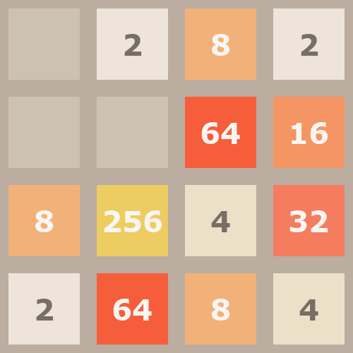

# 2048 🎮

## 🧩 Overview
A single-player puzzle game played on a 4×4 grid. The goal is to combine tiles with the same number by sliding them in one of four directions until reaching the 2048 tile.


## 🎮 Game Mechanics
### 2048 Game Rules

- The game is played on a 4×4 grid. Tiles slide in one of four directions: 'up', 'down', 'left', or 'right'
- Only two consecutive tiles with the SAME value can merge.
      - Row-based merges occur on 'left' or 'right' actions. 
      - Column-based merges occur on 'up' or 'down' actions. 
- All tiles first slide in the chosen direction as far as possible, then merges are applied.
- A tile can merge only once per move. When multiple same-value tiles are aligned (e.g., [2, 2, 2, 2]), merges proceed from the movement direction. For example:
    - [2, 2, 2, 2] with 'left' results in [4, 4, 0, 0].
    - [2, 2, 2, 0] with 'left' results in [4, 2, 0, 0].
- An action is only valid if it causes at least one tile to slide or merge. Otherwise, the action is ignored, and no new tile is spawned. 
- After every valid action, a new tile (90 percent chance of 2, 10 percent chance of 4) appears in a random empty cell. 
- The game ends when the board is full and no valid merges are possible.
-  Score increases only when merges occur, and the increase equals the value of the new tile created from the merge.

### Strategic Considerations
- The key is planning your moves to merge tiles efficiently to create the 2048 tile.
- Think ahead several steps to prevent the board from filling up too quickly.

## 🔍 Observation Space
The observation is a dictionary with the following keys:
- **`obs_str`**: A string containing all game state information in text format (see example below)
    - Board state
    - Score
- **`obs_image`**: RGB image frame from the game
- **`game_info`**: Empty dictionary `{}` (not used for 2048)

### Observation Example (`obs_str`)
```
Board:
[2, 0, 0, 0]
[4, 0, 2, 0]
[4, 0, 0, 0]
[16, 4, 2, 0]
Score: 56
```

### Observation Example (`obs_image`)


## 🎮 Action Space
Given the current state of the board, the agent can choose one of four discrete moves:
```
up, down, left, right
```

Example agent output:
```
down
```

## 🎯 Task Objective
The primary goal is to create the 2048 tile. If the agent fails to reach it, the progress toward creating the 2048 tile is used as the evaluation metric.

## 🧮 Evaluation Metric
When a player first creates the 2048 tile, the total score slightly exceeds 20,000 points. Therefore, we define the normalized progress score toward the 2048 tile as follows.
```
Score = min((Final Score / 20000) × 100, 100)
```

## ⚙️ Implementation Notes
To ensure the game terminates properly, an additional rule is introduced:
- The game ends either when no valid moves remain or after five consecutive moves that produce no change in the board state.