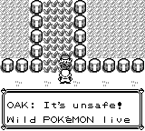

# Pokémon Red 🎮

## 🧩 Overview
A classic turn-based role-playing game where the player explores the Kanto region, catches Pokémon, and battles trainers.  
The benchmark segment focuses on the early storyline through defeating the first gym leader, Brock.

## 🎮 Game Mechanics

### Game States
The game operates in four distinct states, each with specific valid actions:

- **Title State**: Only pressing `A` is allowed. Select 'CONTINUE', not 'NEW GAME'.
- **Field State**: Player can move around the map, interact with objects, and open menus. This is the primary exploration state.
- **Dialog State**: Text is displayed on screen. Use `A` or `B` to advance dialog, or D-Pad + `A` to select choices (indicated by '▶' cursor).
- **Battle State**: Turn-based combat. Can select moves, switch Pokémon, use items, or run from wild battles.

### Controls
- **A Button**: Confirm/Interact/Advance dialog. Use to talk to NPCs, examine signs, and confirm selections.
- **B Button**: Cancel/Back. Can also advance some dialogs or delete incorrect characters in naming screens.
- **Start Button**: Open/close main menu (in Field state).
- **D-Pad**: Move character (Field), move cursor (Dialog/Menu), or change facing direction.

### Map System
Maps use a grid coordinate system where:
- **(0, 0)** is the top-left corner
- **X increases rightward**, **Y increases downward**
- Movement commands: `up` = (x, y-1), `down` = (x, y+1), `left` = (x-1, y), `right` = (x+1, y)

#### Tile Types & Walkability
- **Walkable tiles**: 'O' (open), 'G' (grass), 'WarpPoint', '~' (water, requires Surf HM)
- **Unwalkable tiles**: 'X' (wall), 'Cut' (requires Cut HM), '-' and '|' (barriers), 'TalkTo', 'SPRITE', 'SIGN', '?' (unexplored), Ledges ('D', 'L', 'R')
- **Interactable with 'A'**: 'TalkTo', 'SPRITE' (NPCs), 'SIGN' (readable signs)

#### Map Features
- **Notable Objects**: Listed with coordinates (e.g., `(3, 1) SIGN_REDSHOUSE1F_TV`)
- **WarpPoints**: Special tiles that transport the player to different maps
- **Unexplored '?' tiles**: Revealed when player moves within range (±4-5 tiles)
- **Map Transitions**: Move to walkable boundary tiles on 'overworld' type maps to transition to adjacent areas

### Interaction Rules
- To interact with an object: Stand on an **adjacent walkable tile**, **face the object**, then press **A**
- Dialog after interaction: If `[Interacted Dialog Buffer]` is present, dialog just ended—do not use `continue_dialog` again
- For selection boxes in dialog: Use D-Pad to move '▶' cursor, then press `A` to confirm
- If D-Pad is unresponsive with a selection box visible: Press `B` to advance the dialog

### Battle Mechanics
- **Turn-based combat**: Select action each turn (Move, Item, Switch, Run)
- **Trainer battles**: Cannot run away
- **Wild battles**: Can flee using run command
- **Type advantages**: Different Pokémon types have strengths and weaknesses against each other
- **Status effects**: Pokémon can be affected by conditions like paralysis, poison, sleep, etc.

### Strategy Guidelines
- **Exploration priority**: Reveal '?' tiles to discover new areas, unless blocked by NPCs or progression gates
- **Resource management**: Heal Pokémon at Pokémon Centers, manage inventory items
- **Information gathering**: Talk to NPCs and read signs for hints about progression and game mechanics
- **Obstacle clearing**: Some obstacles require specific HMs (Cut, Surf) or story progression

## 🔍 Observation Space

The observation is a dictionary with three keys:
- **`obs_str`**: A string containing all game state information in text format (see example below)
- **`obs_image`**: RGB image frame from the Game Boy emulator
- **`game_info`**: Empty dictionary `{}` (not used for Pokémon Red)

### Observation String Format
Extracted directly from emulator memory:
- Player location and map
- Party Pokémon (species, level, HP, status)
- Inventory and battle state
- On-screen dialogue text

### Observation Example (`obs_str`)

```
Current State:
State: Field

[Filtered Screen Text]
N/A

[Selection Box Text]
N/A

[Enemy Pokemon]
- Not in battle

[Current Party]
No more Pokemons

[Badge List]
N/A

[Bag]
N/A

[Current Money]: ¥3000

[Map Info]
Map Name: RedsHouse1f, (x_max , y_max): (7, 7)
Map type: reds_house
Expansion direction: 0
Your position (x, y): (7, 1)
Your facing direction: right
Action instruction
- up: (x, y) -> (x, y-1)
- down: (x, y) -> (x, y+1)
- left: (x, y) -> (x-1, y)
- right: (x, y) -> (x+1, y)

[Full Map]
(y=0)
(x=0) 01234567 (x=7)
+--------+
0 | ???XXXXX
1 | ???SOOOW
2 | ???OOOOO
3 | ???OOOOO
4 | ???XXSOO
5 | ???XXOOO
6 | ????????
7 | ????????
(y=7)

[Notable Objects]
( 3, 1) SIGN_REDSHOUSE1F_TV
( 7, 1) WarpPoint
( 5, 4) SPRITE_MOM_1
```

### Observation Example (`obs_image`)


## 🎮 Action Space
The fundamental action space consists of the Game Boy buttons: `up`, `down`, `left`, `right`, `a`, `b`, `start`, and `select`.
Additionally, a set of higher-level tools is available:

- `move_to(x, y)`: Finds and executes a path to the specified map coordinates (x,y).
- `interact_with_object(name)`: Interacts with a specified object in the environment.
- `warp_with_warp_point(x, y)`: Uses a specified warp point to move to a different location.
- `overworld map transition(direction)`: Transitions to an adjacent map in the given direction.
- `continue_dialog()`: Advances the current dialogue.
- `select_move_in_battle(move_name)`: Selects and uses a specific move in a Pokemon battle.
- `switch_pkmn_in_battle(pokemon_name)`: Switches to a different Pokemon in the player’s party during a battle.
- `run_away()`: Attempts to flee from a wild Pokemon battle.
- `use_item_in_battle(item_name)`: Uses a specified item during a Pokemon battle.

Example:
```
use_tool(select_move_in_battle, (move_name="Thunder Shock"))
```

## 🎯 Task Objective
Progress through a series of key storyline milestone of Pokemon Red.

## 🧮 Evaluation Metric
Progress is measured by the number of predefined storyline flags triggered (7 total). The 7 flags are: *Exit Red’s House*, *Encounter Professor Oak*, *Choose a starter Pokemon*, *Finish the first battle with the Rival*, *Arrive in Viridian City*, *Receive Oak’s parcel*, *Deliver Oak’s parcel to Professor Oak*.

```
Score = (Flags triggered / 7) × 100
```

## ⚙️ Implementation Notes
- Only valid actions accepted; invalid joypad combos are ignored.