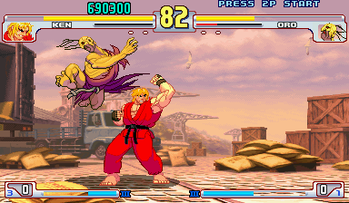

# Street Fighter III 🎮

## 🧩 Overview
A 2D fighting action game where two characters battle in a best-of-three match. Each character has unique moves and super skills. Your agent must defeat a built-in AI opponent by controlling Ken through various actions.
- There are a total of 10 stages, and each stage is played in a best-of-three format.
- A player wins each round by reducing the opponent’s HP to zero before the timer expires, or by having more remaining HP when time runs out.
- The game continues until the player loses a stage or clears all 10 stages, and the final score is determined by the number of stages cleared.

## 🎮 Game Mechanics


### Playable Character
- While multiple playable characters such as Chun-Li are supported in Orak, the playable character is fixed to **Ken** for fair evaluation.

### Combat Mechanics

- The agent determines which high-level action to take based on the current observation.
- Each high-level action (e.g., Fireball) is then converted into a sequence of controller-level inputs before being executed in the game.

### Strategic Considerations

- Choose the appropriate move based on the distance from the opponent and the current situation.
- Utilize defensive or evasive techniques to minimize incoming damage.
- Combine normal attacks and special moves to control space and apply pressure on the opponent.
- If the super bar gauge is full, use Super Action to maximize damage.
- If the distance is close, use close-range attacks to reduce the opponent's health.
- If the distance is far, you can either approach the opponent or use long-range attacks to reduce their health.
- Strategically choose the best action based on current game state.
- If your opponent get stunned, try powerful moves to maximize damage.

## 🔍 Observation Space
The observation is a dictionary with three keys:
- **`obs_str`**: A string containing all game state information in text format (see example below)
    - Player & opponent character
    - Relative distance from the opponent
        - Classified into three discrete categories: *very close*, *close*, or *far*
    - Player's facing direction
        - Left or Right
    - Remaining time
        - Ranging from 0 to 99
    - Player & opponent health
        - Ranging from 1 to 161
    - Super-bar and stun-bar gauges
        - Ranging from 0 to 100
    - Super bar count, stun status
- **`obs_image`**: RGB image frame from the game
- **`game_info`**: A dictionary containing a list of available skills with key "skill_library".

### Observation Example (`obs_str`)
```
You are playing Ken in Street Fighter 3. Your opponent is Yang.
You are facing left.
Distance from Opponent: close
Time Remaining: 95
Health:
    Your Health: 161
    Opponent's Health: 134
Super Bar Guage:
    Your Super Bar Guage: 32
    Opponent's Super Bar Guage: 9
Super Count (Count of activated super move):
    Your Super Count: 0
    Opponent's Super Count: 0
Stun Bar Guage:
    Your Stun Bar Guage: 0
    Opponent's Stun Bar Guage: 10
IsStunned (0: not stunned, 1: stunned):
    Your Status: 0
    Opponent's Special Status: 0
```

### Observation Example (`obs_image`)


### Observation Example (`game_info`)

```
{
  "skill_library": [
    "Move Closer",
    "Move Away",
    "Fireball",
    "Megapunch",
    "Hurricane",
    "Low Punch",
    "Medium Punch",
    "High Punch",
    "Low Kick",
    "Medium Kick",
    "High Kick",
    "Low Punch+Low Kick",
    "Medium Punch+Medium Kick",
    "High Punch+High Kick",
    "Jump Closer",
    "Jump Away",
  ]
}

```


## 🎮 Action Space
In the Diambra environment, the native action space is defined on a per-frame basis
and consists of 18 discrete actions:
- Idle Action (1 total): `Idle`
- Movement Actions (8 total): `Left`, `Left+Up`, `Up`, `Up+Right`, `Right`, `Right+Down`, `Down`, `Down+Left`
- Attack Actions (9 total): `Low/Medium/High Punch`, `Low/Medium/High Kick`,
`Low Punch+Low Kick`, `Medium Punch+Medium Kick`, `High Punch+High Kick`

To enable more strategic and temporally consistent behavior, we use **a higher-level action space** that abstracts these frame-level controls into semantically meaningful commands. Each high-level action is mapped to a predefined sequence of low-level controller inputs, often spanning multiple frames.
The high-level action space includes 21 actions:

- `Move Closer`, `Move Away`, `Jump Closer`, `Jump Away`, `Super Attack`, `Low Punch`, `Medium Punch`, `High Punch`, `Low Kick`, `Medium Kick`, `High Kick`, `Low Punch+Low Kick`, `Medium Punch+Medium Kick`, `High Punch+High Kick`, `Fireball (Hadouken)`, `Dragon Punch (Shoryuken)`, `Hurricane`, `EX-Fireball`, `EX-Dragon Punch`, `Super Dragon Punch (Shouryuu-Reppa)`, `Shippuu-Jinrai-Kyaku`.

Example action format:
```
Actions
- Move Closer
- High Kick
```

## 🎯 Task Objective
Win consecutive matches against the in-game AI across 10 stages of increasing difficulty.

Each stage is played in a best-of-three format, where victory goes to the player who wins two rounds first. A player wins each round by reducing the opponent’s HP to zero before the timer expires, or by having more remaining HP when time runs out.

## 🧮 Evaluation Metric
Score is proportional to the number of stages cleared:
```
Score = (Number of stages cleared) × 10
```

## ⚙️ Implementation Notes
- Each stage consists of best-of-three rounds.
- Observation text is updated each frame; actions are executed sequentially.
- Agents must maintain valid output format.