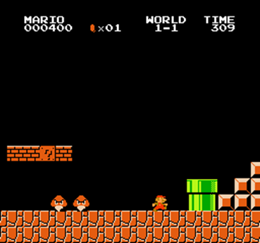

# Super Mario 🎮

## 🧩 Overview
A side-scrolling platformer. Control Mario to avoid obstacles, enemies, and reach the flag at the far right of the stage.

## 🎮 Game Mechanics

### Objects
- **Bricks**: Breakable blocks; may contain items or coins (Size: 16x16)
- **Question Blocks**: Reveal coins or power-ups when hit; deactivate after use (Size: 16x16)
- **Pit**: Falling in results in losing a life
- **Warp Pipe**: Raised above the ground, so Mario must jump over them when it appear in front (Size: 30xHeight(y))
- **Monster Goomba**: Basic enemy; can be defeated by jumping on it (Size: 16x16)
- **Monster Koopa**: Turtle enemy; retreats into shell when jumped on (Size: 20x24)
- **Item Mushroom**: Grows Mario larger, grants protection (Size: 16x16)
- **Stairs**: Used to ascend/descend terrain
- **Flag**: Touch to complete the level
- **Ground**: The ground level in the game is y=32

### Movement & Jump Mechanics
- **Mario** (Size: 15x13) continuously moves to the right at a fixed speed
- You must choose an appropriate jump level to respond to upcoming obstacles
- Each jump level determines both:
  - How far Mario jumps horizontally (x distance)
  - How high Mario reaches at the peak of the jump (y height)
- Jump Levels *(values based on flat ground jumps)*:
  - Level 0: +0 in x, +0 in y (No jump, just walk)
  - Level 1: +42 in x, +35 in y
  - Level 2: +56 in x, +46 in y
  - Level 3: +63 in x, +53 in y
  - Level 4: +70 in x, +60 in y
  - Level 5: +77 in x, +65 in y
  - Level 6: +84 in x, +68 in y

### Strategic Considerations
- The key is choosing the *right jump level at the right moment*
- *Use higher levels* to jump over taller or farther obstacles
- Consider *the size* of Mario and objects
- While jumping, Mario follows a *parabolic arc*, so Mario can be *blocked by objects mid-air or be defeated by airborne enemies*
- Mario can step on top of bricks, blocks, warp pipes, and stairs


## 🔍 Observation Space

The observation is a dictionary with three keys:
- **`obs_str`**: A string containing all game state information in text format (see example below)
- **`obs_image`**: RGB image frame from the game
- **`game_info`**: Empty dictionary `{}` (not used for Super Mario)

### Observation-to-Text Conversion
In this environment, the system only receives RGB image frames from the game as observations.
To make these visual frames understandable for a large language model (LLM), they must be converted into a structured text format that describes what's happening in the scene.

To achieve this, the environment uses visual pattern matching, a technique that compares pixel-level patterns in each frame with a predefined set of visual templates for all in-game objects (like Mario, bricks, question blocks, enemies, or pipes).
Because the SuperMarioBros-v1 environment maintains stable visual patterns across frames, this approach allows the system to accurately detect each object's presence and position.

Once detected, every object's position is converted into 2D coordinates (x, y) and written out as text.
This text acts as the LLM's "eyes," providing a clear symbolic description of the scene.

### Observation Example (`obs_str`)

```
Position of Mario: (122, 45)
Positions of all objects
- Bricks: (92, 88), (124, 95), (156, 95)
- Question Blocks: (18, 95), (108, 95), (140, 95), (124,158)
- Inactivated Blocks: None
- Monster Goomba: None
- Monster Koopas: None
- Pit: start at None, end at None
- Warp Pipe: (223,63,34)
- Item Mushrooms: None
- Stair Blocks: None
- Flag: None
(Note: All (x, y) positions refer to the top-left corner of each object)
```

### Observation Example (`obs_image`)


## 🎮 Action Space
Mario constantly moves right; the agent controls the **jump level** (0–6).

```
- Level 0: +0 in x, +0 in y (No jump, just walk)
- Level 1: +42 in x, +35 in y
- Level 2: +56 in x, +46 in y
- Level 3: +63 in x, +53 in y
- Level 4: +70 in x, +60 in y
- Level 5: +77 in x, +65 in y
- Level 6: +84 in x, +68 in y
```

Example output:
```
Explain: [Reasoning about decision]
Jump Level: 5
```

## 🎯 Task Objective
Advance as far as possible without dying, ideally reach the final flag.

## 🧮 Evaluation Metric
Normalized horizontal progress:

$$
Score = (x_{Mario} – x_{start}) / (x_{flag} – x_{start}) × 100
$$

where $x_{Mario}$, $x_{flag}$ , and $x_{start}$ are the x coordinate of Mario traversed before die, that of the flag (= 3161), and that of the starting position on the map, respectively.

## ⚙️ Implementation Notes
- World 1-1 is the default test level.
- Maximum 100 game steps per run.